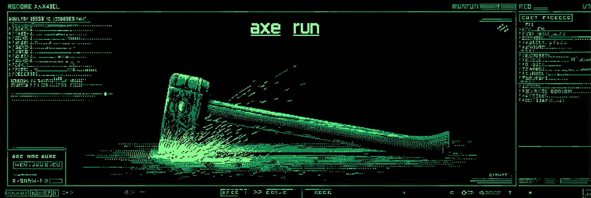

# axe

A CLI tool for managing and running LLM-powered agents.

## Why Axe?

Most AI tooling assumes you want a chatbot. A long-running session with a massive context window doing everything at once. But that's not how good software works. Good software is small, focused, and composable.

Axe treats LLM agents the same way Unix treats programs. Each agent does one thing well. You define it in a TOML file, give it a focused skill, and run it from the command line. Pipe data in, get results out. Chain agents together. Trigger them from cron, git hooks, or CI. Whatever you already use. No daemon, no GUI, no framework to buy into. Just a binary and your configs.

## Overview

Axe orchestrates LLM-powered agents defined via TOML configuration files. Each
agent has its own system prompt, model selection, skill files, context files,
working directory, persistent memory, and the ability to delegate to sub-agents.

Axe is the executor, not the scheduler. It is designed to be composed with
standard Unix tools — cron, git hooks, pipes, file watchers — rather than
reinventing scheduling or workflow orchestration.

## Features

- **Multi-provider support** — Anthropic, OpenAI, and Ollama (local models)
- **TOML-based agent configuration** — declarative, version-controllable agent definitions
- **Sub-agent delegation** — agents can call other agents via LLM tool use, with depth limiting and parallel execution
- **Persistent memory** — timestamped markdown logs that carry context across runs
- **Memory garbage collection** — LLM-assisted pattern analysis and trimming
- **Skill system** — reusable instruction sets that can be shared across agents
- **Stdin piping** — pipe any output directly into an agent (`git diff | axe run reviewer`)
- **Dry-run mode** — inspect resolved context without calling the LLM
- **JSON output** — structured output with metadata for scripting
- **Built-in tools** — file operations (read, write, edit, list), shell command execution, all sandboxed to the agent's working directory
- **Minimal dependencies** — two direct dependencies (cobra, toml); all LLM calls use the standard library

## Installation

Requires Go 1.24+.

```bash
go install github.com/jrswab/axe@latest
```

Or build from source:

```bash
git clone https://github.com/jrswab/axe.git
cd axe
go build .
```

## Quick Start

Initialize the configuration directory:

```bash
axe config init
```

This creates the directory structure at `$XDG_CONFIG_HOME/axe/` with a sample
skill and a default `config.toml` for provider credentials.

Scaffold a new agent:

```bash
axe agents init my-agent
```

Edit its configuration:

```bash
axe agents edit my-agent
```

Run the agent:

```bash
axe run my-agent
```

Pipe input from other tools:

```bash
git diff --cached | axe run pr-reviewer
cat error.log | axe run log-analyzer
```

## Examples

The [`examples/`](examples/) directory contains ready-to-run agents you can copy
into your config and use immediately. Includes a code reviewer, commit message
generator, and text summarizer — each with a focused SKILL.md.

```bash
# Copy an example agent into your config
cp examples/code-reviewer/code-reviewer.toml "$(axe config path)/agents/"
cp -r examples/code-reviewer/skills/ "$(axe config path)/skills/"

# Set your API key and run
export ANTHROPIC_API_KEY="your-key-here"
git diff | axe run code-reviewer
```

See [`examples/README.md`](examples/README.md) for full setup instructions.

## Docker

Axe provides a Docker image for running agents in an isolated, hardened container.

### Build the Image

```bash
docker build -t axe .
```

Multi-architecture builds (linux/amd64, linux/arm64) are supported via buildx:

```bash
docker buildx build --platform linux/amd64,linux/arm64 -t axe:latest .
```

### Run an Agent

Mount your config directory and pass API keys as environment variables:

```bash
docker run --rm \
  -v ./my-config:/home/axe/.config/axe \
  -e ANTHROPIC_API_KEY \
  axe run my-agent
```

Pipe stdin with the `-i` flag:

```bash
git diff | docker run --rm -i \
  -v ./my-config:/home/axe/.config/axe \
  -e ANTHROPIC_API_KEY \
  axe run pr-reviewer
```

Without a config volume mounted, axe exits with code 2 (config error) because no
agent TOML files exist.

### Running a Single Agent

The examples above mount the entire config directory. If you only need to run one
agent with one skill, mount just those files to their expected XDG paths inside
the container. No `config.toml` is needed when API keys are passed via
environment variables.

```bash
docker run --rm -i \
  -e ANTHROPIC_API_KEY \
  -v ./agents/reviewer.toml:/home/axe/.config/axe/agents/reviewer.toml:ro \
  -v ./skills/code-review/:/home/axe/.config/axe/skills/code-review/:ro \
  axe run reviewer
```

The agent's `skill` field resolves automatically against the XDG config path
inside the container, so no `--skill` flag is needed.

To use a **different skill** than the one declared in the agent's TOML, use the
`--skill` flag to override it. In this case you only mount the replacement skill
— the original skill declared in the TOML is ignored entirely:

```bash
docker run --rm -i \
  -e ANTHROPIC_API_KEY \
  -v ./agents/reviewer.toml:/home/axe/.config/axe/agents/reviewer.toml:ro \
  -v ./alt-review.md:/home/axe/alt-review.md:ro \
  axe run reviewer --skill /home/axe/alt-review.md
```

If the agent declares `sub_agents`, all referenced agent TOMLs and their skills
must also be mounted.

### Persistent Data

Agent memory persists across runs when you mount a data volume:

```bash
docker run --rm \
  -v ./my-config:/home/axe/.config/axe \
  -v axe-data:/home/axe/.local/share/axe \
  -e ANTHROPIC_API_KEY \
  axe run my-agent
```

### Docker Compose

A `docker-compose.yml` is included for running axe alongside a local Ollama
instance.

**Cloud provider only (no Ollama):**

```bash
docker compose run --rm axe run my-agent
```

**With Ollama sidecar:**

```bash
docker compose --profile ollama up -d ollama
docker compose --profile cli run --rm axe run my-agent
```

**Pull an Ollama model:**

```bash
docker compose --profile ollama exec ollama ollama pull llama3
```

> **Note:** The compose `axe` service declares `depends_on: ollama`. Docker
> Compose will attempt to start the Ollama service whenever axe is started via
> compose, even for cloud-only runs. For cloud-only usage without Ollama, use
> `docker run` directly instead of `docker compose run`.

### Ollama on the Host

If Ollama runs directly on the host (not via compose), point to it with:

- **Linux:** `--add-host=host.docker.internal:host-gateway -e AXE_OLLAMA_BASE_URL=http://host.docker.internal:11434`
- **macOS / Windows (Docker Desktop):** `-e AXE_OLLAMA_BASE_URL=http://host.docker.internal:11434`

### Security

The container runs with the following hardening by default (via compose):

- **Non-root user** — UID 10001
- **Read-only root filesystem** — writable locations are the config mount, data mount, and `/tmp/axe` tmpfs
- **All capabilities dropped** — `cap_drop: ALL`
- **No privilege escalation** — `no-new-privileges:true`

These settings do not restrict outbound network access. To isolate an agent that
only talks to a local Ollama instance, add `--network=none` and connect it to the
shared Docker network manually.

### Volume Mounts

| Container Path | Purpose | Default Access |
|---|---|---|
| `/home/axe/.config/axe/` | Agent TOML files, skills, `config.toml` | Read-write |
| `/home/axe/.local/share/axe/` | Persistent memory files | Read-write |

Config is read-write because `axe config init` and `axe agents init` write into
it. Mount as `:ro` if you only run agents.

### Environment Variables

| Variable | Required | Purpose |
|---|---|---|
| `ANTHROPIC_API_KEY` | If using Anthropic | API authentication |
| `OPENAI_API_KEY` | If using OpenAI | API authentication |
| `AXE_OLLAMA_BASE_URL` | If using Ollama | Ollama endpoint (default in compose: `http://ollama:11434`) |
| `AXE_ANTHROPIC_BASE_URL` | No | Override Anthropic API endpoint |
| `AXE_OPENAI_BASE_URL` | No | Override OpenAI API endpoint |

## CLI Reference

### Commands

| Command | Description |
|---|---|
| `axe run <agent>` | Run an agent |
| `axe agents list` | List all configured agents |
| `axe agents show <agent>` | Display an agent's full configuration |
| `axe agents init <agent>` | Scaffold a new agent TOML file |
| `axe agents edit <agent>` | Open an agent TOML in `$EDITOR` |
| `axe config path` | Print the configuration directory path |
| `axe config init` | Initialize the config directory with defaults |
| `axe gc <agent>` | Run memory garbage collection for an agent |
| `axe gc --all` | Run GC on all memory-enabled agents |
| `axe version` | Print the current version |

### Run Flags

| Flag | Default | Description |
|---|---|---|
| `--model <provider/model>` | from TOML | Override the model (e.g. `anthropic/claude-sonnet-4-20250514`) |
| `--skill <path>` | from TOML | Override the skill file path |
| `--workdir <path>` | from TOML or cwd | Override the working directory |
| `--timeout <seconds>` | 120 | Request timeout |
| `--dry-run` | false | Show resolved context without calling the LLM |
| `--verbose` / `-v` | false | Print debug info (model, timing, tokens) to stderr |
| `--json` | false | Wrap output in a JSON envelope with metadata |

## Agent Configuration

Agents are defined as TOML files in `$XDG_CONFIG_HOME/axe/agents/`.

```toml
name = "pr-reviewer"
description = "Reviews pull requests for issues and improvements"
model = "anthropic/claude-sonnet-4-20250514"
system_prompt = "You are a senior code reviewer. Be concise and actionable."
skill = "skills/code-review/SKILL.md"
files = ["src/**/*.go", "CONTRIBUTING.md"]
workdir = "/home/user/projects/myapp"
tools = ["read_file", "list_directory", "run_command"]
sub_agents = ["test-runner", "lint-checker"]

[sub_agents_config]
max_depth = 3       # maximum nesting depth (hard max: 5)
parallel = true     # run sub-agents concurrently
timeout = 120       # per sub-agent timeout in seconds

[memory]
enabled = true
last_n = 10         # load last N entries into context
max_entries = 100   # warn when exceeded

[params]
temperature = 0.3
max_tokens = 4096
```

All fields except `name` and `model` are optional.

## Tools

Agents can use built-in tools to interact with the filesystem and run commands.
When tools are enabled, the agent enters a conversation loop — the LLM can make
tool calls, receive results, and continue reasoning for up to 50 turns.

### Built-in Tools

| Tool | Description |
|---|---|
| `list_directory` | List contents of a directory relative to the working directory |
| `read_file` | Read file contents with line-numbered output and optional pagination (offset/limit) |
| `write_file` | Create or overwrite a file, creating parent directories as needed |
| `edit_file` | Find and replace exact text in a file, with optional replace-all mode |
| `run_command` | Execute a shell command via `sh -c` and return combined output |
| `call_agent` | Delegate a task to a sub-agent (controlled via `sub_agents`, not `tools`) |

Enable tools by adding them to the agent's `tools` field:

```toml
tools = ["read_file", "list_directory", "run_command"]
```

The `call_agent` tool is not listed in `tools` — it is automatically available
when `sub_agents` is configured and the depth limit has not been reached.

### Path Security

All file tools (`list_directory`, `read_file`, `write_file`, `edit_file`) are
sandboxed to the agent's working directory. Absolute paths, `..` traversal, and
symlink escapes are rejected.

### Parallel Execution

When an LLM returns multiple tool calls in a single turn, they run concurrently
by default. This applies to both built-in tools and sub-agent calls. Disable
with `parallel = false` in `[sub_agents_config]`.

## Skills

Skills are reusable instruction sets that provide an agent with domain-specific
knowledge and workflows. They are defined as `SKILL.md` files following the
community SKILL.md format.

### Skill Resolution

The `skill` field in an agent TOML is resolved in order:

1. **Absolute path** — used as-is (e.g. `/home/user/skills/SKILL.md`)
2. **Relative to config dir** — e.g. `skills/code-review/SKILL.md` resolves to
   `$XDG_CONFIG_HOME/axe/skills/code-review/SKILL.md`
3. **Bare name** — e.g. `code-review` resolves to
   `$XDG_CONFIG_HOME/axe/skills/code-review/SKILL.md`

### Script Paths

Skills often reference helper scripts. Since `run_command` executes in the
agent's `workdir` (not the skill directory), **script paths in SKILL.md must
be absolute**. Relative paths will fail because the scripts don't exist in the
agent's working directory.

```
# Correct — absolute path
/home/user/.config/axe/skills/my-skill/scripts/fetch.sh <args>

# Wrong — relative path won't resolve from the agent's workdir
scripts/fetch.sh <args>
```

### Directory Structure

```
$XDG_CONFIG_HOME/axe/
├── config.toml
├── agents/
│   └── my-agent.toml
└── skills/
    └── my-skill/
        ├── SKILL.md
        └── scripts/
            └── fetch.sh
```

## Providers

| Provider | API Key Env Var | Default Base URL |
|---|---|---|
| Anthropic | `ANTHROPIC_API_KEY` | `https://api.anthropic.com` |
| OpenAI | `OPENAI_API_KEY` | `https://api.openai.com` |
| Ollama | (none required) | `http://localhost:11434` |

Base URLs can be overridden with `AXE_<PROVIDER>_BASE_URL` environment variables
or in `config.toml`.

## License

Apache-2.0. See [LICENSE](LICENSE).
